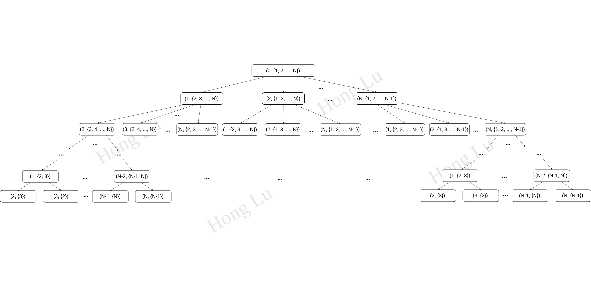

\_\_author\_\_="Hong Lu"

\_\_email\_\_= "hl2358@cornell.edu"

# TravelSalesmanProblem
TSP problem solver

## Brutal Force

[code] [Brutal Force Method](tsp.py)

TIME Complexity is O(n!) 

### illusitration

General idea is below, as shown in picture

We can recursively calculate the result by using defined function *Get_minimum()*

## Dynamic Programming

## Linear Programming

Last Update: 6/27/2019